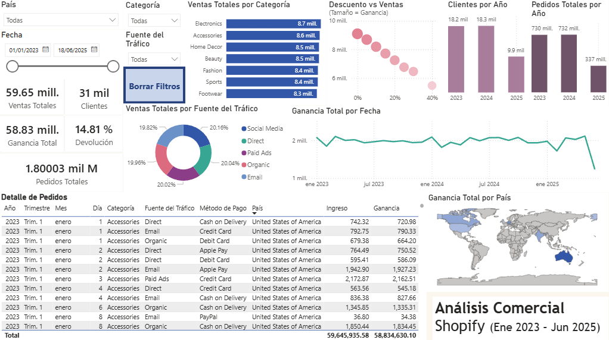

# Análisis Comercial de Shopify - Power BI

## Descripción:
Dashboard interactivo desarrollado en Power BI para analizar ventas, ganancias, clientes y desempeño comercial utilizando un dataset de Shopify.
## Objetivo:
Transformar datos de ventas en visualizaciones ejecutivas que apoyen la toma de decisiones comerciales.
## Hallazgos:
- Las ganancias mostraron estabilidad entre 2023 y 2025.
- Algunas categorías concentraron mayor volumen de ventas.
- El tráfico comercial tuvo distribución equilibrada.
- Los descuentos mostraron relación con el desempeño comercial.
## KPIs Incluidos:
- Ventas Totales
- Ganancia Total
- Clientes
- Pedidos
- Tasa de devolución
- Ganancia por país
- Fuente de tráfico
## Herramientas Utilizadas:
- Power BI
- Power Query
- DAX
- CSV
- Data Visualization
## Archivos:
- .pbix → dashboard editable
- .pdf → versión exportada
- .csv → dataset utilizado